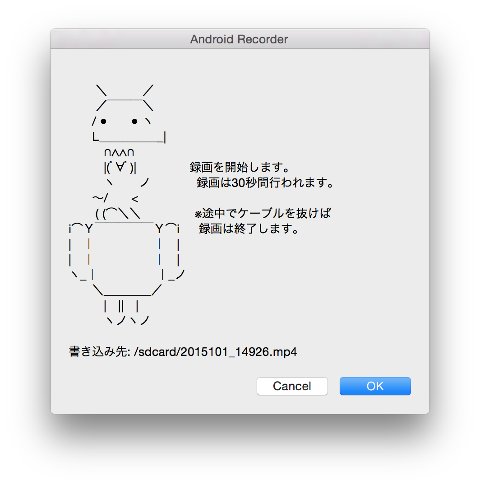

## Overview
Wrap `adb shell scrennrecord` with `AppleScript`.

## Setup
Please open `AndroidRecorder.sprt` with **AppleScript Editor**

You should edit the path to `ADB`. Default path is `/usr/local/bin/adb`.

## Export
Apple Script can export to app.
`File` > `Export` > `File Fortmat: Application`

## Run
You can run with Exported App or AppleScript Editor.
